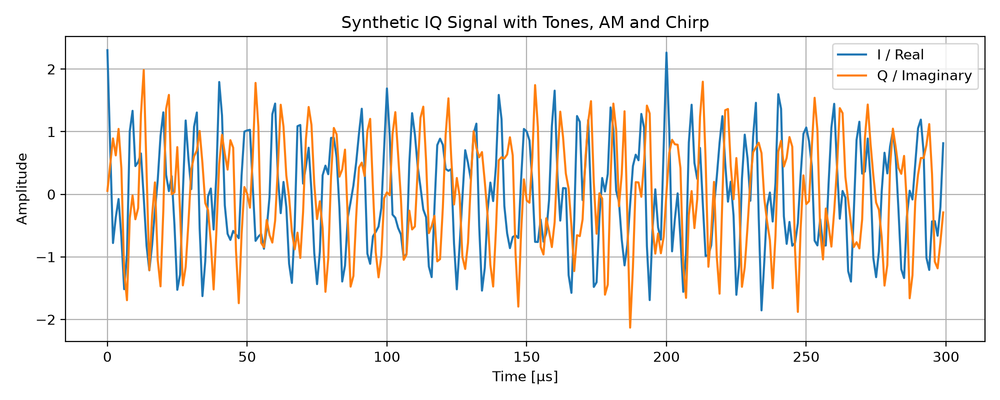
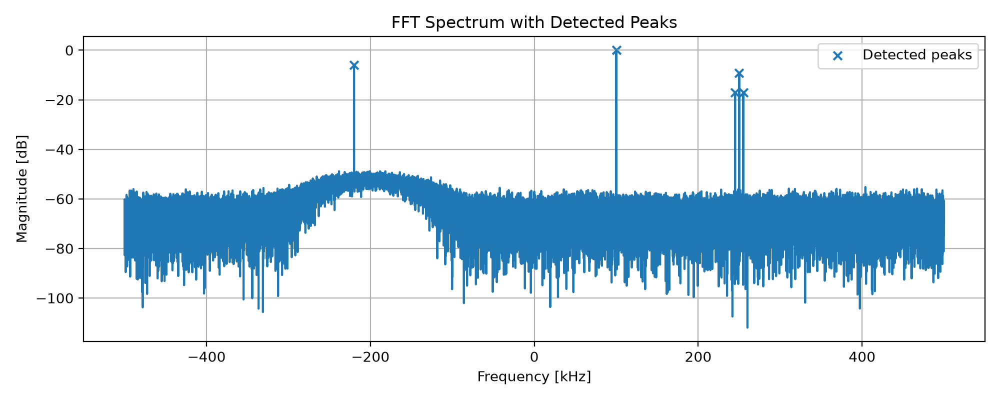
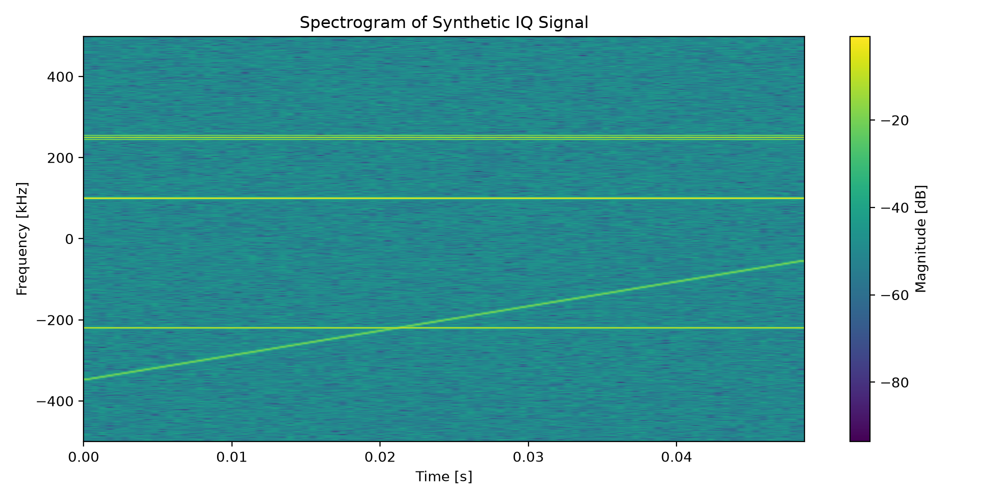

# SDR Spectrum Analyzer & Signal Analysis Toolkit

A Python-based spectrum analysis toolkit for synthetic IQ signals, designed as a foundation for future SDR hardware integration.

The project currently generates synthetic complex IQ signals, performs FFT-based spectrum analysis, detects signal peaks, estimates noise floor and SNR, and produces spectrograms using STFT.

## Features

- Synthetic complex IQ signal generation
- Multi-tone signal simulation
- AM signal simulation with carrier and sidebands
- Chirp signal simulation
- Complex Gaussian noise
- FFT spectrum analysis
- Hann windowing
- Peak detection
- Noise floor estimation
- SNR estimation
- Spectrogram / STFT visualization
- CSV export of detected peaks
- Automatic plot export
- Reproducible noise generation using a fixed random seed
- Modular project structure for future SDR hardware integration

## Current Synthetic Signals

The current demo includes:

- Tone at +100 kHz
- Tone at -220 kHz
- AM signal centered at +250 kHz with 5 kHz modulation
- Chirp sweeping from -350 kHz to -50 kHz
- Complex Gaussian noise

## Analyzer Settings

- Sampling frequency: 1 MHz
- Duration: 50 ms
- Frequency span: -500 kHz to +500 kHz
- FFT frequency resolution: 20 Hz/bin
- Random seed: 42 for reproducible noise generation

## Outputs

The program generates:

```text
outputs/detected_peaks.csv
outputs/figures/time_domain_iq.png
outputs/figures/fft_spectrum.png
outputs/figures/spectrogram.png
```


```markdown
## Example Figures

### Time-Domain IQ Signal



### FFT Spectrum with Detected Peaks



### Spectrogram


## Example Results

Detected peaks include:

```text
-220 kHz
+100 kHz
+245 kHz
+250 kHz
+255 kHz
```

The AM signal produces a carrier at **250 kHz** and sidebands at **245 kHz** and **255 kHz**.

Example terminal output:

```text
Estimated noise floor:
-65.25 dB

Detected peaks:
 -220.00 kHz | Level:  -6.01 dB | SNR:  59.24 dB
  100.00 kHz | Level:  -0.00 dB | SNR:  65.25 dB
  245.00 kHz | Level: -17.08 dB | SNR:  48.17 dB
  250.00 kHz | Level:  -9.12 dB | SNR:  56.13 dB
  255.00 kHz | Level: -17.10 dB | SNR:  48.15 dB
```

## Installation

Create a virtual environment:

```bash
python -m venv .venv
```

Activate the virtual environment on Windows PowerShell:

```bash
.\.venv\Scripts\Activate.ps1
```

Install dependencies:

```bash
python -m pip install -r requirements.txt
```

## Run

```bash
python main.py
```

## Project Structure

```text
sdr-spectrum-analyzer/
├── main.py
├── requirements.txt
├── README.md
├── .gitignore
├── src/
│   ├── __init__.py
│   ├── config.py
│   ├── synthetic.py
│   ├── spectrum.py
│   ├── detection.py
│   ├── io_utils.py
│   └── visualization.py
└── outputs/
    ├── detected_peaks.csv
    └── figures/
        ├── time_domain_iq.png
        ├── fft_spectrum.png
        └── spectrogram.png
```

The `.venv/` directory is used locally but is excluded from version control through `.gitignore`.

## How It Works

The signal processing pipeline is:

```text
Synthetic IQ samples
        ↓
Add complex Gaussian noise
        ↓
Apply Hann window
        ↓
Compute FFT
        ↓
Shift spectrum to -fs/2 ... +fs/2
        ↓
Convert magnitude to dB
        ↓
Detect peaks
        ↓
Estimate noise floor and SNR
        ↓
Export CSV and plots
```

## Main Modules

### `main.py`

Runs the complete analysis pipeline:

- Creates output folders
- Generates synthetic IQ data
- Computes FFT spectrum
- Detects peaks
- Estimates noise floor and SNR
- Saves the detected peak report
- Generates and saves plots

### `src/config.py`

Stores the main project settings:

- Sample rate
- Signal duration
- Peak detection threshold
- Spectrogram settings
- Random seed

### `src/synthetic.py`

Generates synthetic complex IQ signals:

- Single tones
- AM signal
- Chirp signal
- Complex Gaussian noise

### `src/spectrum.py`

Performs frequency-domain analysis:

- FFT spectrum
- Hann windowing
- Spectrogram / STFT

### `src/detection.py`

Handles signal analysis:

- Peak detection
- Noise floor estimation
- SNR calculation
- Peak report creation

### `src/io_utils.py`

Handles output files:

- Creates output directories
- Saves detected peaks to CSV

### `src/visualization.py`

Creates and saves plots:

- Time-domain IQ plot
- FFT spectrum plot
- Spectrogram plot

## Notes

This project currently uses synthetic IQ data only.

The signal generation section can later be replaced with real IQ samples from SDR hardware, while keeping the FFT, peak detection, SNR estimation, CSV export, and visualization pipeline almost unchanged.

This makes the project suitable as a first step toward a real SDR spectrum analyzer.

## Future Work

Planned additions:

- RTL-SDR live sample input
- Real-time spectrum display
- Configurable sample rate and center frequency
- Bandwidth estimation
- Occupied bandwidth measurement
- Signal classification experiments
- GUI interface