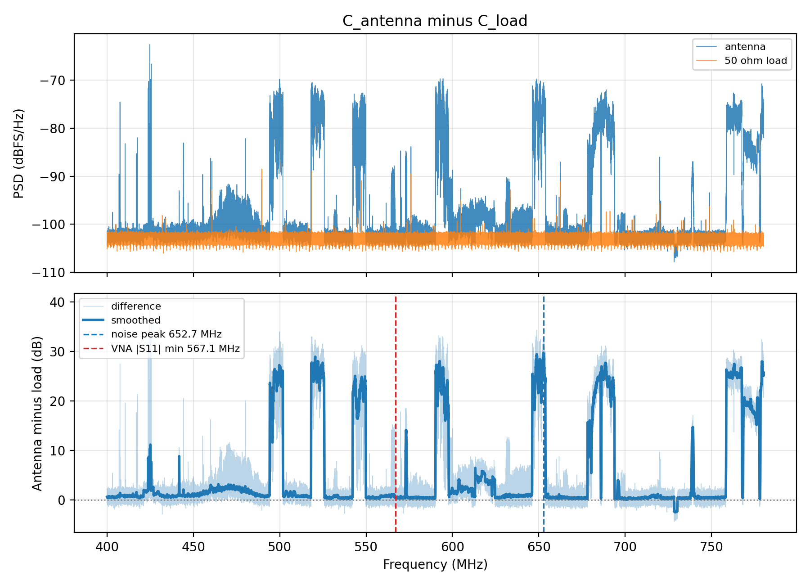

# SDR Spectrum Analyzer & Signal Analysis Toolkit

A spectrum analyser written in Python and driven from an RTL-SDR Blog V4. It
does three things: it surveys everything the receiver can hear between 24 and
1766 MHz and reports what is on the air, it measures an antenna's resonance
from the rise in the receiver's own noise floor, and it analyses synthetic IQ
signals for development and teaching.

The analysis chain is validated rather than assumed. A simulated source builds
IQ samples whose power spectral density is known by construction, and
`python main_sdr.py selftest` reads it back through the same Welch estimator
the measurements use:

```text
  noise floor at 700 MHz       expected  -113.02 dBFS/Hz   measured  -113.03   error -0.010 dB
  sidebands at 100.3 MHz       expected   -70.00 dBFS/Hz   measured   -70.07   error -0.069 dB

PASS: worst error 0.069 dB, within 0.50 dB
```

## Contents

- [What it does](#what-it-does)
- [Install](#install)
- [Wideband survey](#wideband-survey)
- [Antenna resonance from the noise floor](#antenna-resonance-from-the-noise-floor)
- [Synthetic signal analysis](#synthetic-signal-analysis)
- [How it works](#how-it-works)
- [Validation](#validation)
- [Checking the frequency axis against television](#checking-the-frequency-axis-against-television)
- [Limits](#limits)
- [Project structure](#project-structure)

## What it does

| Command | Purpose |
| --- | --- |
| `python main_sdr.py survey` | Sweep the whole tuning range repeatedly and store mean, max hold and occupancy |
| `python main_sdr.py report` | Detect, identify and plot the signals in a stored survey |
| `python main_sdr.py capture` | Sweep one band once, for the antenna measurement |
| `python main_sdr.py compare` | Difference an antenna sweep against a 50 ohm load sweep |
| `python main_sdr.py raster` | Check the frequency axis against the UHF television channel plan |
| `python main_sdr.py selftest` | Check the analyser against a source of known density, no hardware needed |
| `python main.py` | Synthetic IQ demonstration: tones, AM, chirp, FFT, spectrogram |

Capture and analysis are always separate commands. A measurement can be
re-analysed, re-thresholded and re-plotted months later without the hardware
present, and the settings that produced it travel with the file.

## Install

```bash
python -m venv .venv
.\.venv\Scripts\Activate.ps1      # Windows PowerShell
python -m pip install -r requirements.txt
```

`pyrtlsdr` is only the Python wrapper. The driver library has to be installed
separately:

- **Windows**: install the RTL-SDR Blog release bundle, run Zadig once to put
  the device on WinUSB, then copy `rtlsdr.dll` next to `main_sdr.py` or set
  `RTLSDR_DLL_DIR` to the folder holding it.
- **Linux**: `apt install librtlsdr-dev`
- **macOS**: `brew install librtlsdr`

Two version pins matter and both are explained in `requirements.txt`:
`pyrtlsdr` is held at 0.2.93 because later releases bind `rtlsdr_set_dithering`,
which the RTL-SDR Blog Windows build does not export, and `pkg_resources` is
stubbed in `src/sdr_source.py` rather than dragged in through an obsolete
`setuptools`.

## Wideband survey

```bash
python main_sdr.py survey --label home --passes 6
python main_sdr.py report --label home
```

Defaults to 24 to 1766 MHz on a 10 kHz grid. One pass is about 900 tuning
steps and takes roughly two minutes, and the command prints its own estimate
before it starts.

Everything runs without the radio by adding `--simulate`, which substitutes a
source containing broadcast FM, DAB, DVB-T, cellular, TETRA, aeronautical and
satellite emitters, plus a harmonic and two oscillator spurs planted on
purpose. Files and figures produced this way are labelled `SIMULATED`.

### What comes out

```text
outputs/surveys/home.npz               the survey, re-analysable
outputs/surveys/home_signals.csv       one row per detected signal
outputs/surveys/home_report.md         settings, results, artefacts, limits
outputs/figures/home_overview.png      the whole range, band plan shaded behind
outputs/figures/home_waterfall.png     passes against frequency
outputs/figures/home_band_*.png        a panel per busy band, with occupancy
```

The terminal gets the short version:

```text
Noise floor: 10th percentile over 40.0 MHz
26 signals above floor + 8 dB
3 flagged as probable receiver artefacts

    Frequency      Width     SNR    Occ  Band
  100.3005 MHz   200.0 kHz   53.7   100%  FM
  124.1550 MHz    20.0 kHz   37.3    17%  Airband
  144.0050 MHz    20.0 kHz   29.2    83%  2 m
  200.6003 MHz   200.0 kHz   29.1   100%  DAB
  942.6573 MHz   220.0 kHz   26.8   100%  GSM900 DL
  390.1957 MHz    40.0 kHz   25.5    67%  TETRA BOS
  526.8251 MHz  7620.0 kHz   17.3   100%  DVB-T
 1090.3469 MHz  1720.0 kHz   16.4    17%  ADS-B
```

### Useful options

```bash
# one band, finer grid, many passes for occupancy statistics
python main_sdr.py survey --label vhf --start 130e6 --stop 180e6 --bin 2e3 --passes 30

# a weaker threshold and more band panels when re-analysing
python main_sdr.py report --label home --snr 6 --zooms 10

# wider noise floor window when a band is continuously occupied
python main_sdr.py report --label home --floor-window 80
```

## Antenna resonance from the noise floor

A matched antenna delivers far more external noise into the receiver than a
50 ohm resistor does. Sweeping a band twice, once with each on the input, and
subtracting gives a difference that peaks where the antenna is matched. The
receiver's own gain, conversion loss and ADC scaling are unknown, but they are
the *same* unknown in both sweeps, so they cancel: the measurement is designed
around the missing calibration rather than in spite of it.

```bash
python main_sdr.py capture --label A_antenna --start 100e6 --stop 190e6
python main_sdr.py capture --label A_load    --start 100e6 --stop 190e6
python main_sdr.py compare --antenna A_antenna --reference A_load \
                           --vna ../dipole-sim-vs-measurement/data/A_meas_1.s1p
```

Both sweeps of a pair must use the same gain, sample rate and band. The
settings are recorded in each file and `compare` refuses a mismatched pair,
because the cancellation is the whole basis of the method.

### What happened when it was tried

Eight sweeps were taken on a roof in Thessaloniki on 21 September 2026, an
antenna and a 50 ohm load for each of the four dipole lengths measured in
[dipole-sim-vs-measurement](https://github.com/ioannidisphysics/dipole-sim-vs-measurement).
**The method did not measure the resonance.** The difference between the two
sweeps is flat at zero except where a transmitter is on the air:

| Setup | Band (MHz) | Tuner gain (dB) | Median antenna minus load (dB) |
| --- | --- | --- | --- |
| A | 100 – 190 | 19.7 | −0.00 |
| D | 670 – 1300 | 19.7 | +0.01 |
| B | 160 – 310 | 29.7 | +0.05 |
| C | 400 – 780 | 29.7 | +0.85 |

The reason is the noise figure of the receiver. A rise of 3 dB needs the
external noise arriving through the antenna to equal the receiver's own; the
rise actually seen, under 1 dB, means the receiver is 6 dB or more louder than
the sky. Backing the tuner gain off raises the noise figure roughly dB for dB,
and at 19.7 dB — 30 dB below this tuner's maximum — the receiver drowns
everything the antenna delivers.

The four sweeps are their own evidence for that explanation rather than an
appeal to theory: **the two runs at 29.7 dB show a rise, the two at 19.7 dB
show none**, and the gain is the only thing that differs.



The upper panel is the measurement that did work. The 50 ohm floor is flat at
−103 dBFS/Hz, the antenna sits on top of it between transmitters, and seven
DVB-T multiplexes stand 20 to 30 dB clear. Reading a resonance out of that
trace would mean reading it out of the transmitters' positions, which say
where the television masts are, not where the antenna is matched.

`compare` now says so itself instead of returning a number:

```text
Broadband noise rise:     -0.00 dB median, +0.12 dB at the 90th percentile
Noise rise peak:          162.98 MHz at 2.89 dB

RECEIVER NOISE LIMITED. The antenna raises the floor by only -0.00 dB, against
the 3.0 dB this method needs.
```

Without that check the same run reports a resonance at 162.98 MHz for an
antenna the VNA puts at 143.22 MHz, and nothing in the output hints that the
number came from a broadcast carrier. The threshold is `--min-rise`.

**What to change before repeating it.** Raise the tuner gain to the highest
value that does not trip the clipping warning in `capture`, which is likely to
be near 40 dB at UHF and lower at VHF, where broadcast FM overloads the front
end from outside the swept band. An FM band-stop filter ahead of the receiver
is what makes high gain usable at VHF.

## Synthetic signal analysis

`python main.py` generates a complex IQ signal containing two tones, an AM
signal with its sidebands and a chirp, then runs the FFT, the peak detection,
the noise floor and SNR estimate and the spectrogram, and writes the figures
and a CSV. It needs no hardware and is the quickest way to see the processing
chain end to end.

## How it works

### Covering 1.7 GHz with a 2.4 MHz receiver

The tuner sees 2.4 MHz at a time, so a survey retunes across the band and
keeps the usable middle of each capture. Two parts of every capture are thrown
away: the centre, where the DC offset and 1/f noise of the direct conversion
receiver sit, and the edges, where the analogue anti-alias filter is already
rolling off. Keeping the edges would put a scallop into the stitched trace
with the period of the tuning step, which is easy to mistake for structure in
the signal.

Throwing away the centre creates a different problem. On a fixed tuning grid
the survey is blind at the same 900 or so frequencies on every pass, and a
signal sitting on one of them is never seen at all. **The tuning grid is
therefore staggered between passes**, by a fraction of the step width, so the
holes land somewhere else each time. It costs one extra tuning step per pass.

### Three detectors, not one trace

A single sweep of the whole range samples each channel for a few tens of
milliseconds, so it says almost nothing about a channel that transmits in
bursts. Several passes are accumulated into the three reductions a bench
analyser offers:

- **mean** — average power, the right statistic for the noise floor
- **max hold** — the largest power seen in any pass, which is what catches
  bursts
- **occupancy** — the fraction of passes in which a bin stood above its own
  local noise floor, which separates a carrier that is always on from one that
  keys up occasionally

Averaging is done on power, never on decibels. The mean of two traces in dB is
the geometric mean of the powers, which reads several dB low on a noisy trace
and would make the noise floor depend on how many passes were run.

The Welch estimate inside each step has a resolution bandwidth of about 880 Hz.
Over 1.7 GHz that is two million points, so the trace is binned to 10 kHz
cells, averaging power within each cell and keeping the peak separately. That
is also why the noise estimate in the survey is smoother than in a single
sweep.

### The noise floor is not a number

Across 24 to 1766 MHz the floor moves by more than 20 dB: the tuner's gain is
not flat, the antenna is resonant somewhere and deaf elsewhere, and man made
noise dominates the low VHF end and is absent at 1.5 GHz. A single threshold
marks the whole low end as occupied and misses everything at the top.

The floor used here is a sliding low percentile of the trace, which follows
the receiver while ignoring the signals sitting on it. The window has to be
wide enough that the widest signal takes up well under the percentile being
asked for: at the default 40 MHz window, a 10 MHz LTE block or a 7.6 MHz
television multiplex occupies a quarter of it at most, so the 10th percentile
comes from bins outside the signal. Narrow the window and a DVB-T multiplex
disappears into its own floor and is reported as a handful of edge fragments
instead of one 7.6 MHz block.

### A signal is not a peak

Peak finding is right for tones in a laboratory spectrum and wrong here: a
DVB-T multiplex is 7.6 MHz of flat, noise-like power with no peak at all, and
a peak finder reports it as dozens of unrelated bumps. What is measured
instead is the contiguous run of bins standing above the floor, reported once,
with its edges. Two thresholds are used: a run starts where the trace crosses
floor + 8 dB and is extended while it stays above floor + 5 dB, so the flat
top of a wide signal, which wanders by a couple of dB, is not chopped into
pieces.

Each run yields its edges, its peak frequency by parabolic interpolation, its
power-weighted centre, the 99% occupied bandwidth as ITU-R SM.443 defines it,
the channel power above the floor, and its occupancy.

### Identification

Every detection is looked up in a frequency allocation table for ITU Region 1
as it applies in Greece (`src/bands.py`), which resolves overlapping entries in
favour of the narrowest, so 1090 MHz reads as ADS-B rather than as the
aeronautical block containing it. The table is what turns a list of
frequencies into something checkable: an FM carrier has to land on an odd
multiple of 100 kHz, a DAB block has to be 1.536 MHz wide, a GSM downlink
carrier has to be in the downlink half. Where a detection contradicts the
table, the detection is the thing that needs explaining.

### Naming the artefacts

Not everything detected is on the air. An eight bit receiver overloaded by a
nearby transmitter produces harmonics of it, and the 28.8 MHz reference
oscillator leaks into the tuner at its multiples. Both look exactly like
carriers. They cannot be removed from the trace, but they can be named, and
the report does so with the test that settles each one:

- a **reference spur** stays when the antenna is disconnected, a real signal
  disappears
- a **harmonic** falls by 20 to 30 dB when the gain is reduced by 10 dB, a real
  signal falls by 10

### A free frequency reference

FM broadcast carriers in Region 1 sit on odd multiples of 100 kHz, so the
offset between the detected carriers and their channels is the crystal error
of the receiver plus whatever the stitching contributes. The report measures
it across every FM carrier it found, converts it to ppm and prints the
`--ppm` correction to pass back to the capture.

## Validation

```bash
python main_sdr.py selftest
```

`src/simulated.py` builds IQ samples in the frequency domain, giving each FFT
bin the amplitude that a designed power spectral density implies. Whatever the
analyser reports afterwards can be compared against the number that went in,
which turns the window normalisation, the Welch scaling and the equivalent
noise bandwidth of the window into something tested rather than believed. The
current worst error is 0.07 dB.

The same source drives `--simulate`, so the detector, the band identification
and the artefact flagging can be checked against a scene whose contents are
known: the planted harmonic and the two oscillator spurs are expected to be
found and flagged, the GPS signal placed below the noise floor is expected to
be missed, and the emitters with low duty cycles are expected to be missed
some of the time, which is the point occupancy is there to make.

## Checking the frequency axis against television

The selftest above validates the amplitude scale against a source this
repository built. It cannot validate the frequency axis, because the same code
places the signal and reads it back. Terrestrial television can, and costs
nothing:

```bash
python main_sdr.py raster --antenna C_antenna --reference C_load
```

In the ITU Region 1 UHF plan a DVB-T channel of index n is centred on
306 + 8n MHz and occupies 7.61 MHz of its 8 MHz slot. Those numbers come from
the broadcaster's licence, so comparing the blocks found in a sweep against
them is an absolute check:

```text
 channel  raster MHz  measured MHz  width MHz  error kHz      ppm  flag
------------------------------------------------------------------------
      27         522       521.994       7.61       -6.2    -11.8
      30         546       546.006       7.57        6.4     11.7
      36         594       593.980       7.56      -19.7    -33.2
      43         650       650.000       7.60       -0.4     -0.7
      48         690       689.989       7.58      -10.9    -15.8
      57         762       763.002       9.06     1002.5   1315.6  partial block, not counted
      58         770       773.026       9.23     3025.5   3929.2  partial block, not counted

5 clean multiplexes
mean occupied bandwidth 7.58 MHz against the DVB-T figure of 7.61 MHz
frequency error -10.0 ppm, spread 16.8 ppm
```

Five multiplexes land on the 8 MHz raster within 20 kHz, and their measured
occupied bandwidth agrees with the standard to 0.4%. The stitching, the
retuning and the Welch axis are therefore right to about 30 ppm, which is the
crystal error of an uncorrected RTL-SDR and is the limit of this check rather
than of the analyser: the 201 bin smoothing needed to find the block edges
already blurs them by ±90 kHz.

The two blocks at the top of the sweep are wider than a multiplex and are
excluded automatically. They are adjacent channels merged into one run, which
is what the width test is for.

## Limits

- **Levels are dBFS per Hz, not dBm.** The receiver has no absolute
  calibration. Numbers compare within a survey and against another survey at
  the same gain, and nothing more. Converting them would need a source of
  known power.
- **The trace is the antenna as much as the air.** A band that looks empty may
  be a band the antenna cannot hear.
- **Occupancy is sampled, not monitored.** Each bin is observed for a few tens
  of milliseconds per pass. A channel that transmits rarely can be missed
  entirely.
- **Wide continuous occupation defeats the floor estimator.** Where a band is
  occupied across more than about nine tenths of the floor window, the floor
  rises with the signals and wide emissions are reported by their edges.
  Widening `--floor-window` is the first thing to try.
- **An overloaded front end invents signals.** The flags are the first check,
  reducing the gain is the second.
- **The antenna-against-load method needs the sky to be louder than the
  receiver.** Below about 3 dB of broadband rise the difference carries no
  information about the antenna, and `compare` reports that rather than a
  frequency. High tuner gain is what buys the margin, and a strong out of band
  transmitter is what takes it away.
- **The tuner stops at 1766 MHz.** Wi-Fi, Bluetooth and the 2.45 GHz patch
  antenna are above it and need a downconverter.

## Project structure

```text
sdr-spectrum-analyzer/
├── main.py                 synthetic IQ demonstration
├── main_sdr.py             hardware: survey, report, capture, compare, raster, selftest
├── requirements.txt
├── src/
│   ├── config.py           all settings, with the reasoning for each
│   ├── sdr_source.py       opening the RTL-SDR, retuning, clipping check
│   ├── simulated.py        source of known density, for testing and --simulate
│   ├── psd.py              Welch PSD, window noise bandwidth, smoothing
│   ├── sweep.py            one stitched sweep of a band
│   ├── survey.py           repeated sweeps, staggered grid, the three detectors
│   ├── signals.py          noise floor, detection, measurement, artefact flags
│   ├── bands.py            ITU Region 1 allocation table and lookup
│   ├── waterfall.py        overview, waterfall and per band figures
│   ├── report.py           the markdown report
│   ├── antenna_noise.py    antenna against 50 ohm load, and its sensitivity check
│   ├── raster_check.py     frequency axis against the UHF television plan
│   ├── synthetic.py        synthetic IQ generation
│   ├── spectrum.py         FFT spectrum and spectrogram
│   ├── detection.py        peak detection for the synthetic path
│   ├── io_utils.py         output folders and CSV
│   └── visualization.py    plots for the synthetic path
└── outputs/
    ├── surveys/            .npz surveys, signal CSVs, markdown reports
    ├── sweeps/             .npz sweeps for the antenna measurement
    └── figures/
```

Surveys are stored compressed and are a few megabytes each; `outputs/**/*.npz`
is kept out of version control.
